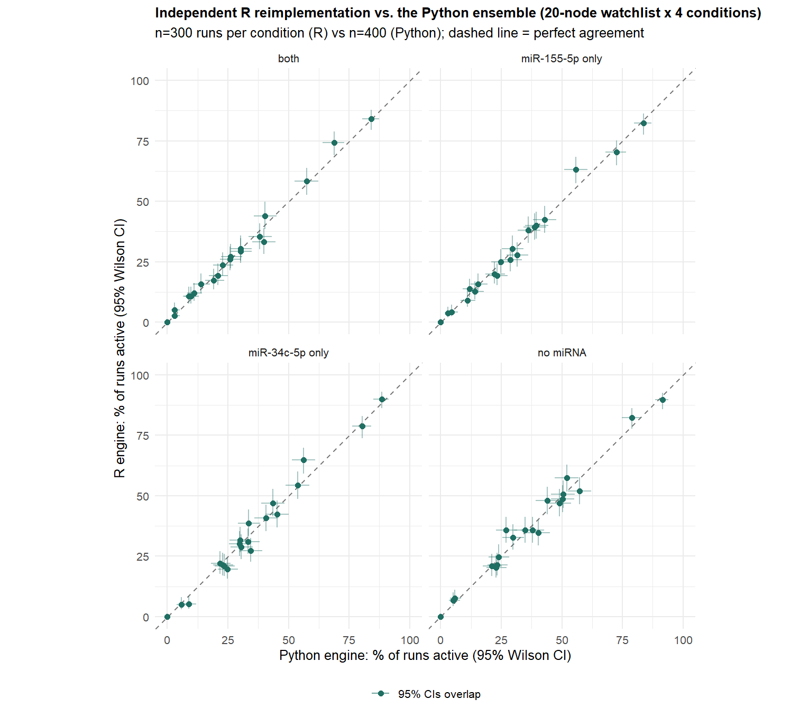
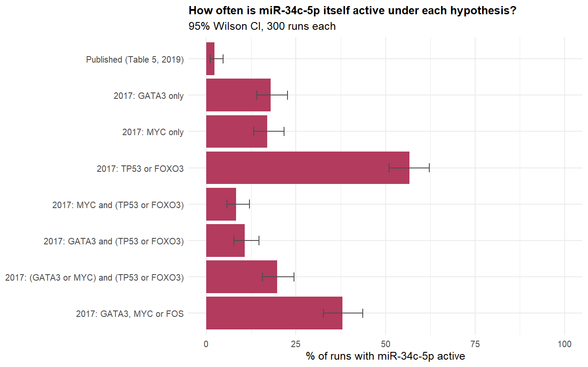
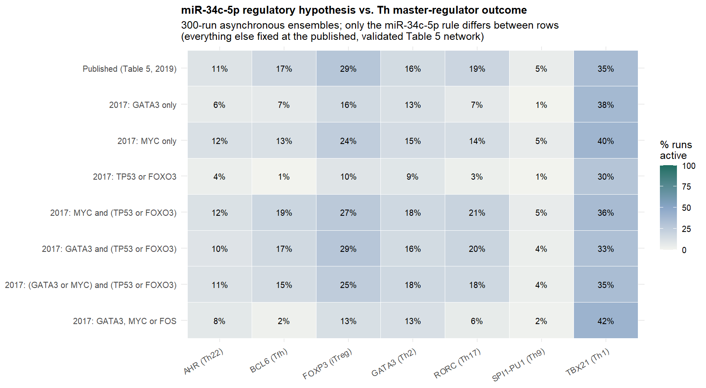
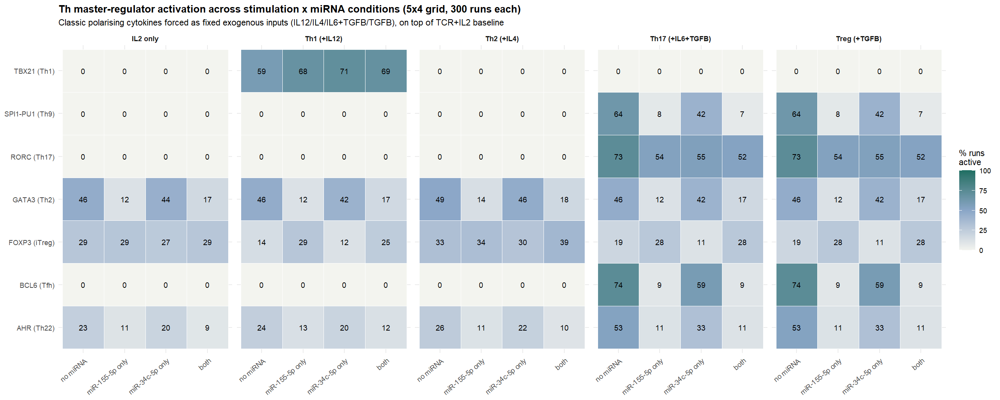

# R re-analysis (2026): the real 2016-2017 modelling folder, redone properly

This extends the Python reimplementation (`../src/`) with an independent R
port, built specifically to (a) re-test two real historical experiments found
in `ThesisNDPhD/Modelling/` under proper statistical conditions, and (b)
cross-validate the Python engine against a second, independently-written
implementation. All output is ggplot2. R 4.6.1 + tidyverse installed for this.

## What was in the Modelling folder

`ThesisNDPhD/Modelling/` is the real, unedited 2016-2017 working directory:
hundreds of `.zginml`/`.ginml` GINsim exports (mostly redundant dated
snapshots) plus a family of R scripts (`Base files/GinSimR_ND.R` and its
descendants) that **hand-roll GINsim's async multi-valued update semantics**
via `gsub()` text substitution on raw formula strings, then `eval(parse(...))`.
That approach has a real, demonstrated failure mode: `gsub()` has no
word-boundary awareness, so a missing `|` between `TGFBR` and `IL6R` in three
of the `formulae_*.txt` files silently concatenates into `"TGFBRIL6R"`, which
gets substituted into a numeric string and `eval()` coerces to `TRUE` — the
rule silently behaves like `(TGFBR | IL6R)` rather than raising an error. Two
further transcription bugs were found the same way (a missing hyphen in
`!miR34c-5p`, meaning that suppression term never actually matched anything;
missing parentheses changing `TGFBR | TGFB_e & !miR-34c-5p`'s operator
grouping). None of this is fixed *in place* — the original files are
historical record — but `logic_engine.R` here uses a proper tokenizer/parser
specifically so the same bug class can't recur.

Two real, well-defined experiments were identifiable and worth re-running:

1. **`mir-34c tf variations/formulae_*.txt`** — seven hand-written hypotheses
   for which transcription factors regulate miR-34c-5p, tested by loading a
   whole alternate rule file per hypothesis and eyeballing base-R/plotly
   trajectory plots. Diffing the files showed each "combo" file also drifted
   4 unrelated rules along with the intended one (its own miR-155-5p rule, an
   IL4 rule, a STAT3 rule, a GATA3 rule) — confounding any single-factor
   read of the original plots.
2. **`Naldi 2010/` and `AJ 2015/` stimulation folders** — Th1(+IL12) /
   Th2(+IL4) / Th17(+IL6+TGFB) / Treg(+TGFB) cytokine cocktails, each crossed
   with which miRNA(s) are active, one `.zginml` GINsim export per condition,
   never assembled into a single comparison.

## 1. Cross-validation: does an independent R engine agree with the Python one?

`cross_validation.R` re-runs the same 4 miRNA conditions (no miRNA / 34c
only / 155 only / both) already reported in Results Table 6, on the
identical 89-rule table (exported byte-for-byte from `rules_data.py` via
`export_rules_tsv.py`, not retyped), and compares against the published
Python output (`output/full_results_with_ci.csv`).

**Result: 80/80 node x condition pairs (20-node watchlist x 4 conditions)
have overlapping 95% Wilson CIs. Mean absolute difference 2.1 percentage
points, max 8.7pp.** Two independently-written simulators, in two different
languages, agree closely — real, if informal, evidence the digitized rule
table's dynamics aren't an artifact of either implementation.

## 2. miR-34c-5p regulatory hypotheses, re-tested one variable at a time

`master_regulator_variations.R` takes the final, published, already-validated
89-rule network and swaps in *only* the miR-34c-5p rule -- each of the 7
historical hypotheses plus the published rule as reference -- run as proper
300-run asynchronous ensembles with Wilson 95% CIs (neither statistic existed
in the original exploration).

**Headline finding: the published rule (`GATA3 & MYC & (TP53|FOXO3|SP1)`,
AND-based) makes miR-34c-5p active in only 2.3% of runs (CI 1.1-4.7%) --
far more restrictive than any of the 7 OR-based hypotheses explored in 2017
(8.3-56.7%).** The final rule requiring both GATA3 *and* MYC together is a
substantially tighter gate than anything tried during exploration.

**Second finding: despite that huge swing in how often miR-34c-5p itself
turns on, the downstream Th master-regulator distribution barely moves
across hypotheses** (see heatmap) -- in this network, final Th commitment is
evidently driven mostly by other pathways (TCR/IL2 signalling, miR-155-5p),
not by exactly how permissive miR-34c-5p's own transcription rule is.

## 3. Stimulation x miRNA grid (5 stimulation conditions x 4 miRNA conditions)

`stimulation_grid.R` runs the full 89-rule model under IL2-only baseline
plus the four classic Th-polarising cytokine cocktails (mirroring the
Naldi/AJ stimulation folders' own convention exactly, ligand-forcing
mechanism identical to `src/validate_biology.py`), crossed with all 4 miRNA
conditions -- 20 conditions total, none of which were ever assembled into one
comparison in the original folders (one `.zginml` GINsim export per
condition, no aggregate view).

**Validation check** (no-miRNA, does the textbook master TF respond to its
own polarising cytokine): TBX21/Th1 59.3% (IL12), GATA3/Th2 49.3% (IL4),
RORC/Th17 73.3% (IL6+TGFB) all respond as expected. FOXP3/iTreg under TGFB
alone reaches only 18.7% -- *below* the unstimulated baseline (29.0%) --
reproducing the discrepancy already documented in Results Table 9
("traced to a specific, documented feature of the digitized STAT3 rule").

**This R analysis pins that mechanism down exactly.** `RORC`'s rule is
`TGFBR & STAT3`; `STAT3`'s rule is `(TGFBR | IL6R | IL23R | IL1R) & ...` --
an OR-gate. Forcing TGFB alone already activates TGFBR, which alone already
saturates STAT3's OR-gate -- so adding IL6 on top (the nominal Th17 cocktail)
changes *nothing* downstream: **the Th17 and Treg columns of the grid are
provably, exactly identical**, not a simulation artifact. And `FOXP3`'s own
de-novo induction rule contains an explicit `!(STAT3 & RORC)` suppression
term -- so TGFB-alone stimulation activates precisely the STAT3+RORC
combination that blocks its own induction. TGFB, in this digitized rule
table, cannot promote FOXP3 without also tripping the term that suppresses
it. That is a structural property of the published rule table, independent
of which engine simulates it -- worth weighing directly against the
Discussion chapter's existing critique of the miR-34c-5p/TF edges (section
4.3) as a further concrete candidate for revision.

## Files

- `logic_engine.R` -- tokenizer/parser/evaluator/ensemble (proper parser, not the gsub-substring approach)
- `load_rules.R`, `condition_models.R` -- data loading + condition-building helpers
- `cross_validation.R`, `master_regulator_variations.R`, `stimulation_grid.R` -- the three analyses
- `data/` -- rules.tsv/aliases.tsv (exported from Python), all result TSVs
- `figures/` -- all ggplot2 PNGs
